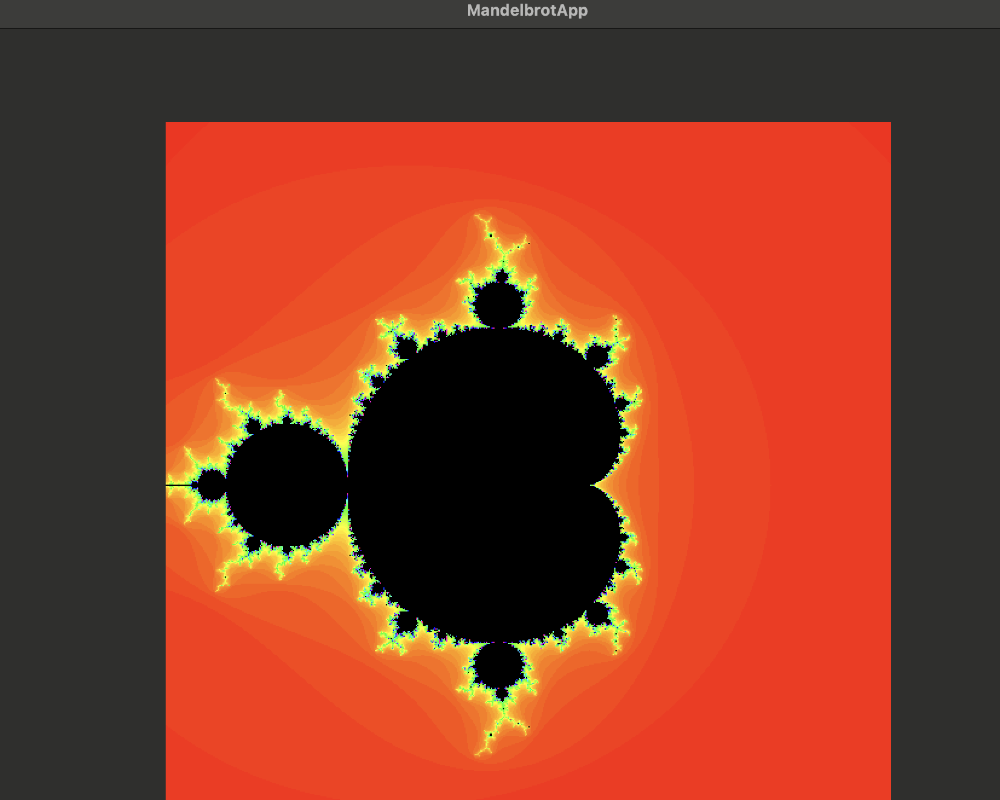

# Mandelbrot

Mandelbrot est une application macOS écrite en Swift qui permet d'explorer l'ensemble de Mandelbrot.
Ce projet a pour but d'illustrer la génération et la visualisation de fractales en utilisant Swift.

## Fonctionnalités

- Calcul et affichage de l'ensemble de Mandelbrot
- Interface simple et rapide
- Code source clair et documenté

## Prérequis

- macOS
- Swift (via Xcode ou swift.org)
- [Swift Package Manager](https://swift.org/package-manager/)

## Installation

Clonez le dépôt puis compilez :

```sh
git clone https://github.com/fte/Mandelbrot.git
cd Mandelbrot
swift build
```

## Lancement

```sh
swift run
```

## Contribution

Les contributions sont les bienvenues !
Ouvrez une issue ou une pull request pour proposer des améliorations.

## Licence

MIT
